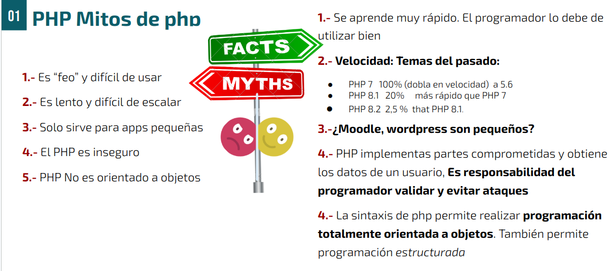
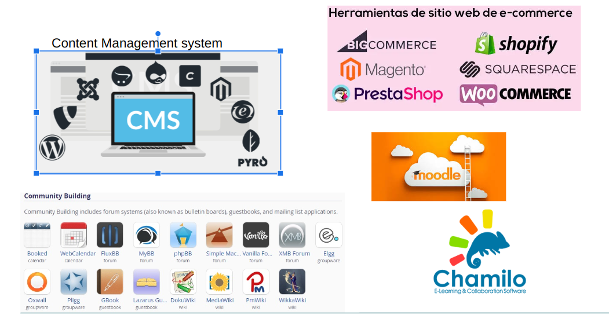

## PHP: ¿Merece la pena aprender este lenguaje ?
Sobre Php es un lenguaje del que se oyen críticas.
{}
__:question: Merece la pena aprenderlo__
{}

***

***
## Mitos de php

***
PHP Vs Javascipt https://youtu.be/hZhQyA5cvDs?list=RDLVhZhQyA5cvDs
***
## PHP Dónde se usa
* __Content management systems (CMS)__: WordPress, Drupal, Joomla, Magento, TYPO3, Contao, eZ Publish, MODX, SilverStripe, Bolt, October CMS, Grav, etc.
* __E-commerce platforms__: WooCommerce, Shopify, PrestaShop, OpenCart, Magento, Zen Cart, osCommerce, Shopware, Spree Commerce, Sylius, etc.
* __Learning management systems (LMS)__: Moodle, Chamilo, Docebo, ATutor, Claroline, Forma LMS, ILIAS, Open edX, Sakai, etc.
* __Forum software__: phpBB, Simple Machines Forum (SMF), MyBB, Flarum, Vanilla Forums, Discourse, FluxBB, PunBB, etc.
* __Wiki software__: MediaWiki, DokuWiki, Tiki Wiki CMS Groupware, PmWiki, MoinMoin, Foswiki, WikkaWiki, etc.
* __Social networking software__: Elgg, Dolphin, Oxwall, HumHub, SocialEngine, BuddyPress, etc.
* __Project management software:__ Redmine, MantisBT, OpenProject, Trac, ProjectSend, Collabtive, etc.
* __Customer relationship management (CRM)__ software: SuiteCRM, SugarCRM, Vtiger CRM, Zurmo, EspoCRM, Dolibarr, etc.
* __Human resource management (HRM) software__: OrangeHRM, Sentrifugo HRM, FrontAccounting, WaypointHR, etc.
* __Billing and invoicing software__: InvoicePlane, Simple Invoices, FusionInvoice, Akaunting, etc.
* __Help desk software__: osTicket, OTRS, GLPI, Zammad, HESK, etc.
* __Web analytics software__: Matomo (formerly Piwik), Open Web Analytics (OWA), AWStats, GoAccess, etc.

## El lenguaje PHP

[//]: # ()


